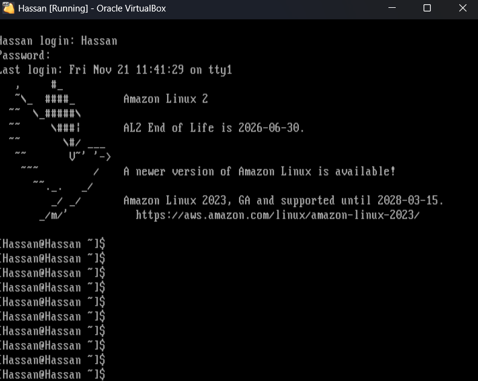
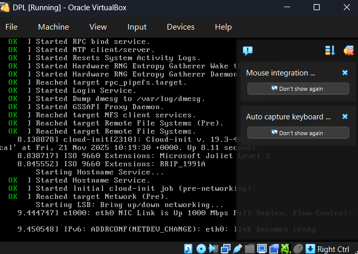

<h1 align="center">dpl_devops_training</h1>

<h3 align="center" style="color:#00a86b;">Daily DevOps Practice • Virtualization • Cloud-init</h3>

---

## 🎧 Study Log – Linux Essentials Video

I completed the **Linux Essentials** walkthrough on YouTube: [https://www.youtube.com/watch?v=sWbUDq4S6Y8](https://www.youtube.com/watch?v=sWbUDq4S6Y8). The session is split into the following chapters:

- ⌨️ 0:00:00 – Introduction  
- ⌨️ 0:01:38 – Chapter 1: Introduction to Linux Families  
- ⌨️ 0:07:39 – Chapter 2: Linux Philosophy and Concepts  
- ⌨️ 0:16:37 – Chapter 3: Linux Basics and System Startup  
- ⌨️ 1:05:36 – Chapter 4: Graphical Interface  
- ⌨️ 1:34:29 – Chapter 5: System Configuration from the Graphical Interface  

The video focuses on theory and desktop-oriented workflows; it does **not** include an Amazon Linux 2 tutorial, so I paired it with the AWS documentation to handle my own AL2 VirtualBox setup.

---

## 🗓️ Daily Progress – Amazon Linux 2 VM Setup

### 🎯 Objective
I set up an Amazon Linux 2 virtual machine on VirtualBox using the official AWS `.vdi` disk and a freshly generated `seed.iso` so cloud-init could preconfigure my environment with my `Hassan` user.

### 🖼️ Visual Timeline

I began by preparing the host PC, downloading the prebuilt Amazon Linux 2 VirtualBox image, and creating a fresh VM definition. Selecting “Other Linux (64-bit)” and enabling EFI early on ensured the GPT/XFS disk could boot properly.

Generating the `seed.iso` caused the bulk of the friction: `mkisofs` initially complained about a missing `cygwin1.dll`, then about `user-data.txt` / `meta-data.txt`, and finally about the required `cidata` label. After rereading the AWS guide and leaning on generative AI tips, I switched to a portable `mkisofs.exe`, copied the DLL into place, and rebuilt the ISO with extensionless files and the correct volume label.

VirtualBox threw extra curveballs (“cannot register hard disk” and “please use an appropriate kernel for your CPU”). I fixed the first by cleaning the Media Manager entries and relocating the `.vdi`, and solved the second by recreating the VM as 64-bit with EFI enabled. After attaching the regenerated `seed.iso`, the VM finally booted with my hostname and `Hassan@337` credentials applied automatically.

### ⚙️ Challenges & Fixes
- `mkisofs` missing `cygwin1.dll` → copied the DLL next to the binary.
- Files saved as `.txt` → renamed to plain `user-data` / `meta-data`.
- Wrong ISO label → regenerated with `-volid cidata`.
- VirtualBox “cannot register hard disk” → removed stale entries via Media Manager and used a shorter path.
- Kernel/CPU boot error → recreated VM as 64-bit and enabled EFI.

Generative AI guidance reinforced the AWS documentation details (file naming, ISO flags, EFI needs), which helped me break through each issue.

---

## 🛠️ Hands-on Practice Summary

- Downloaded the official Amazon Linux 2 VirtualBox `.vdi`.  
- Authored `user-data` and `meta-data` for cloud-init (custom `Hassan` user + hostname).  
- Generated a fresh `seed.iso` with the `cidata` volume label via portable `mkisofs.exe`.  
- Built a new VirtualBox VM (EFI enabled), attached both `.vdi` and `seed.iso`, and validated first boot.  
- Captured screenshots to document each stage for this README.

---

## 📦 Repo Contents

- `README.md` – daily report, study log, and setup narrative (this file).  
- `user-data` / `meta-data` – cloud-init configs (extensionless, ready for ISO).  
- `seed.iso` – generated ISO that injects my configuration on first boot.  
- PNG screenshots documenting each step of the VM setup.

---

## 📚 References

- AWS Amazon Linux 2 VM preparation guide (cloud-init + VirtualBox).  
- Linux Essentials video (timestamped above) for foundational review.
