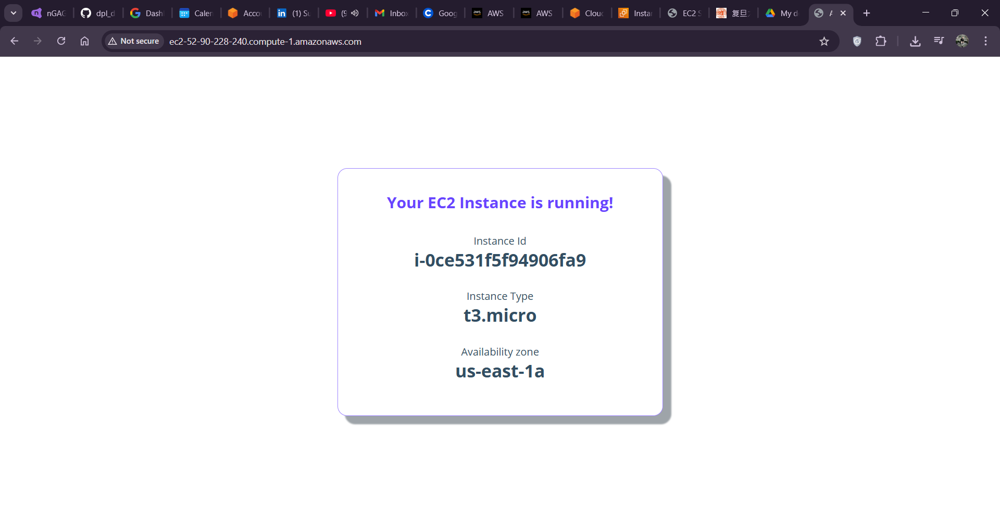
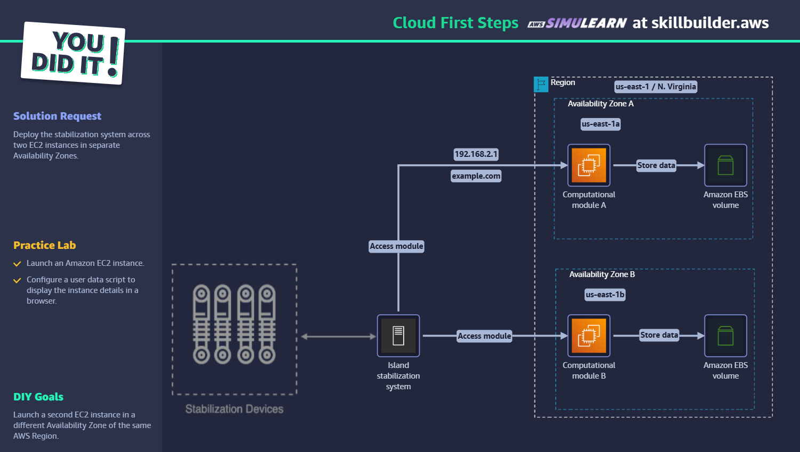
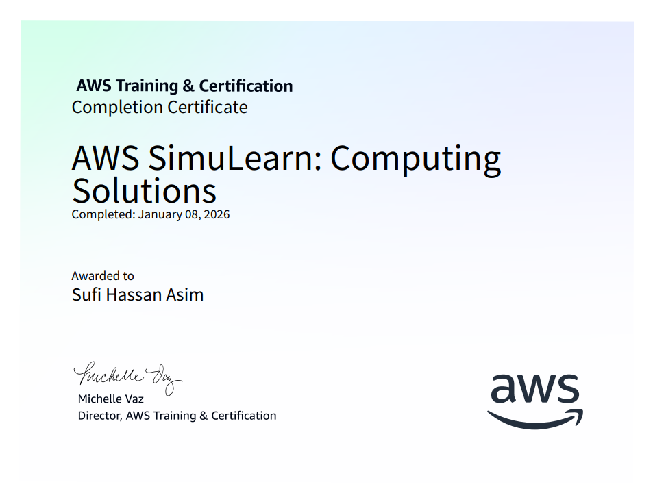

<h1 align="center">dpl_devops_training</h1>

<h3 align="center" style="color:#007bff;">Daily DevOps Practice • Cloud Fundamentals & Labs</h3>

---

## 🎯 Objective Recap
- Continue Cloud fundamentals training and complete hands-on lab exercises
- Capture certificates and lab evidence in `images/`

---

## 🛠️ Study / Work Environment
- **Host OS:** Windows
- **Focus Areas:** Cloud Computing Essentials, Cloud First Steps lab, Computing Solutions lab

---

## 📚 Notes & Key Learnings

### Cloud Computing Essentials
- Completed the Cloud Computing Essentials course and reviewed core cloud concepts (IaaS, PaaS, SaaS, regions/zones, storage types)
- Collected certificate of completion (see images)

### Lab Work — Cloud First Steps & Computing Solutions
- Executed the **Cloud First Steps** lab (part 1 and completion) to practice account setup, basic resource provisioning, and verification
- Completed **Computing Solutions** lab exercises — validated configuration and recorded screenshots

---

## ✅ Work Summary (detailed)
1. **Cloud Computing Essentials** — Finished course and saved certificate to `images/`.
2. **Cloud First Steps Lab (Part 1 + Completed)** — Practiced provisioning and verification steps; screenshots captured in `images/`.
3. **Computing Solutions Lab** — Completed lab tasks and captured completion evidence.

---

## 📁 Files & Evidence
- **Certificates:** `images/CloudComputingEssentials certificate of compleation .png`, `images/ComputingSolutions certificate of comnpletion .png`, `images/CloudFirstSteps certificate of compleation.png`
- **Lab screenshots:** `images/Cloud First Steps lab part 1.png`, `images/CloudFirstStepsLabDone.png`, `images/computing solution lab part 1.png`, `images/ComputingSolutionsLabDone.png`

---

## 🖼️ Screenshots (embedded)

### Cloud Computing Essentials Certificate

### Cloud First Steps — Lab

### Computing Solutions — Lab & Certificate

---

## 🚀 Key Skills Acquired
- Cloud basics and service models (IaaS/PaaS/SaaS)
- Resource provisioning and verification in hands-on labs
- Lab troubleshooting and documentation of results

---

## ✅ Status & Next Steps
- **STATUS:** Cloud fundamentals and labs completed with certificates and lab screenshots collected
- **NEXT:** Continue with the follow-up labs and begin connecting basic services across accounts for multi-service workflows

---

Made by Sufi Hassan Asim — 2026-01-08
