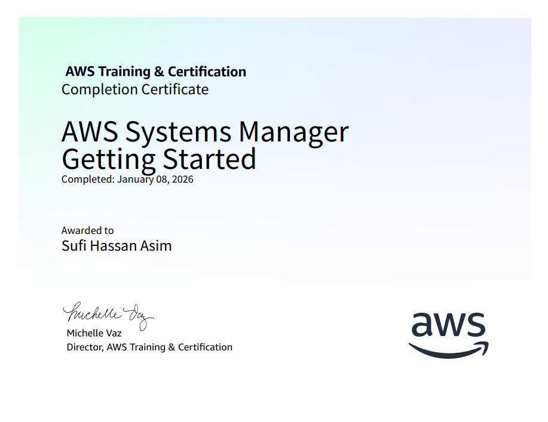
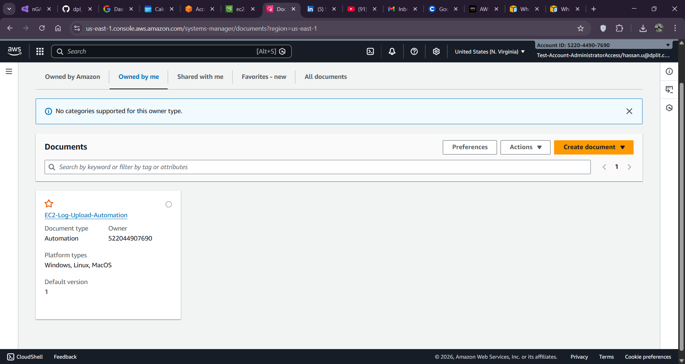
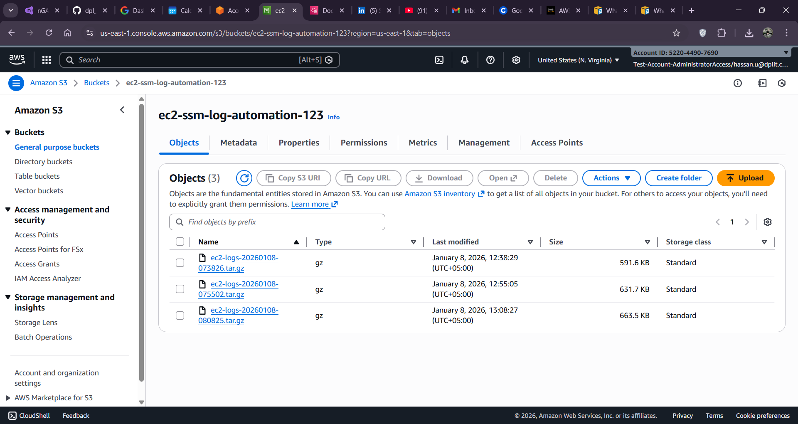
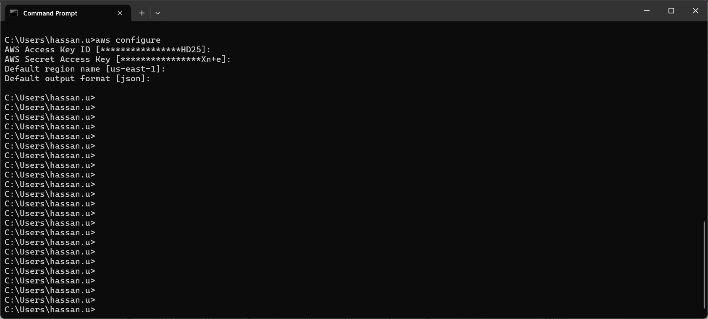

<h1 align="center">dpl_devops_training</h1>

<h3 align="center" style="color:#007bff;">Daily DevOps Practice • AWS SSM & EC2 Log Automation</h3>

---

## 🎯 Objective Recap
- Complete AWS Systems Manager (SSM) training and implement automation to collect EC2 logs and centralize them in S3
- Save evidence (screenshots, logs) in the `images/` and `ec2-logs-20260108-083729/` folders

---

## 🛠️ Study / Work Environment
- **Host OS:** Windows
- **Focus Areas:** AWS Systems Manager automation, EC2 logging, S3 validation

---

## 📚 Notes & Key Learnings

### AWS Systems Manager (SSM)
- Completed an AWS Systems Manager course and obtained the certificate (see `images/`)
- Learned to create SSM automation documents and tasks to gather log files from EC2 instances

### EC2 Log Collection & S3 Upload Automation
- Built an SSM automation to collect system logs from an EC2 instance and upload them to an S3 bucket
- Verified successful uploads by inspecting the S3 bucket contents and the local `ec2-logs-20260108-083729/` output
- Captured screenshots of automation runs and S3 verification

---

## ✅ Work Summary (detailed)
1. **AWS Systems Manager course** — Completed and saved certificate to `images/`.
2. **Created SSM automation** to upload EC2 logs to S3; tested and verified that logs appear in the bucket.
3. **Collected EC2 logs** into `ec2-logs-20260108-083729/` and saved relevant script/parameters files (`parameters.txt`, `user-data.txt`).

---

## 📁 Files & Evidence
- **Course Certificate:** `images/AWS systems manager course certificate of compleation .png`
- **Automation Evidence:** `images/SSM automation created to upload the ec2 logs to teh s3 bucket task assigned .png`, `images/SSM automation created to upload the ec2 logs to teh s3 bucket task assigned varifing the s3 bucket content to see the ec2 logs are uploaded .png`
- **Configuration screenshot:** `images/aws config with access key code .png`
- **EC2 logs:** `ec2-logs-20260108-083729/` (collected logs)

---

## 🖼️ Screenshots (embedded)

### AWS Systems Manager Certificate

### SSM Automation & S3 Verification

### AWS CLI / Config screen

---

## 🚀 Key Skills Acquired
- AWS Systems Manager automation creation and testing
- EC2 log collection and S3 centralization
- Basic AWS CLI configuration and credential management

---

## ✅ Status & Next Steps
- **STATUS:** SSM automation implemented and verified, logs successfully uploaded to S3
- **NEXT:** Harden automation with IAM least-privilege, add scheduling for periodic log uploads, and automate log lifecycle management

---

Made by Sufi Hassan Asim — 2026-01-09
