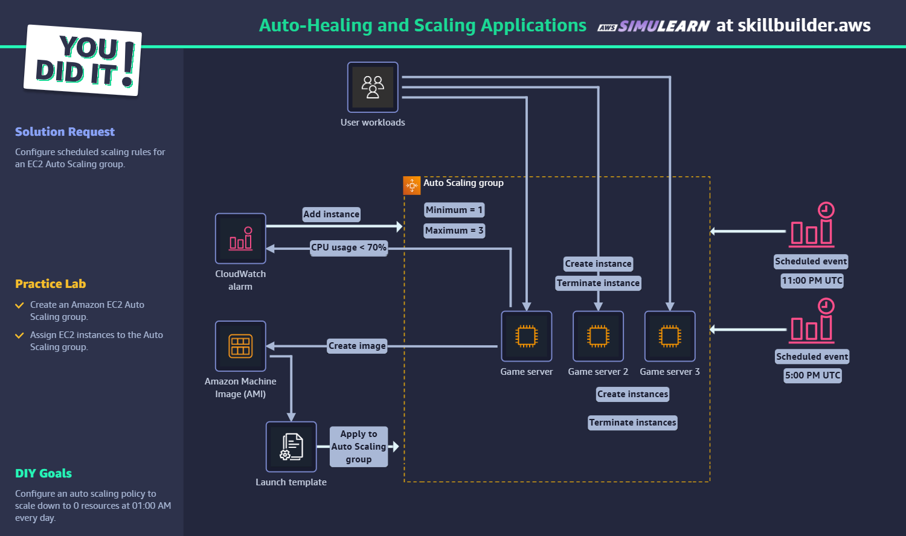
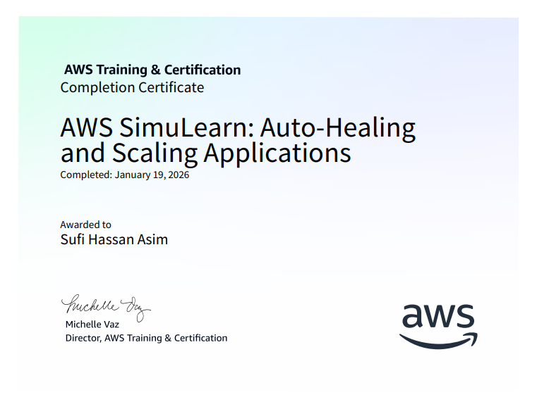
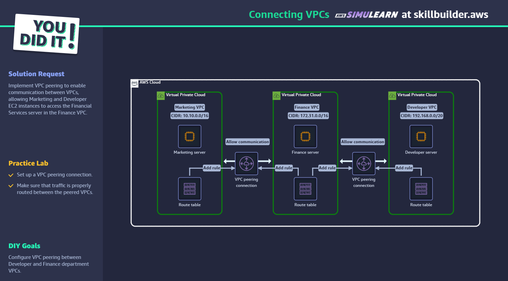
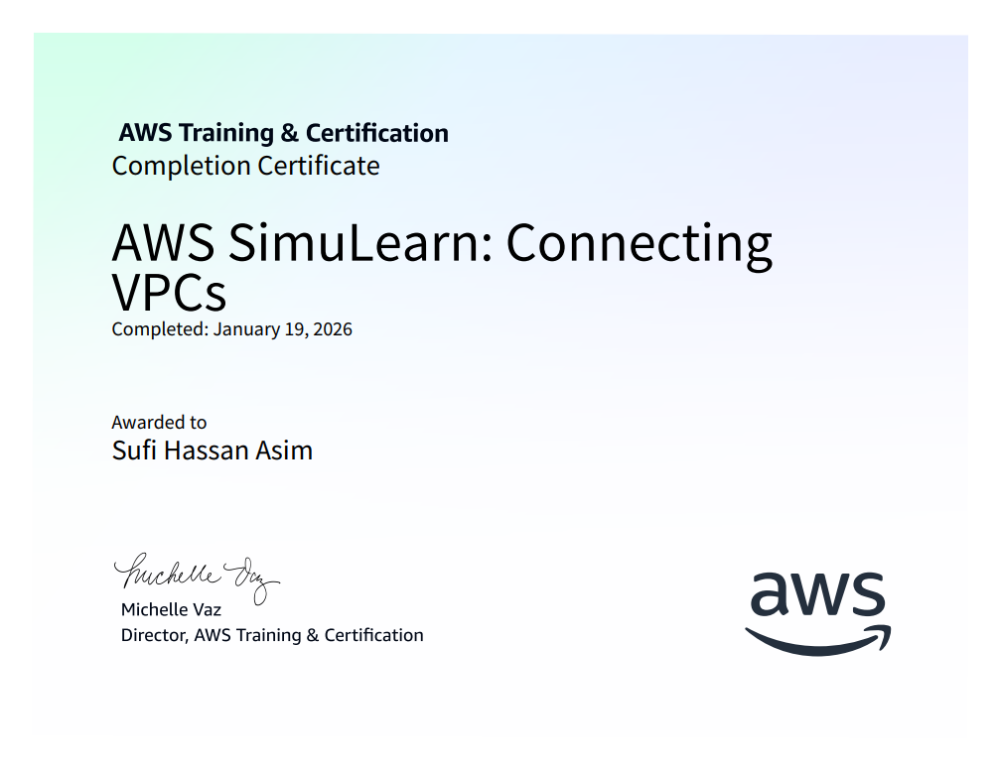
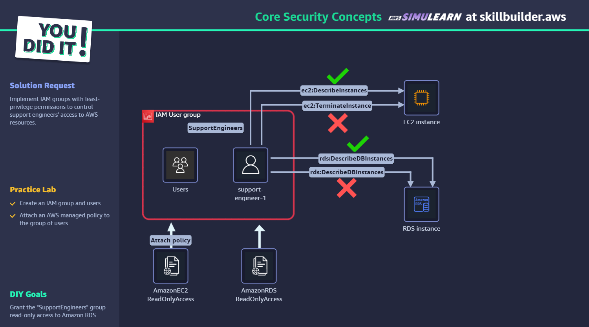
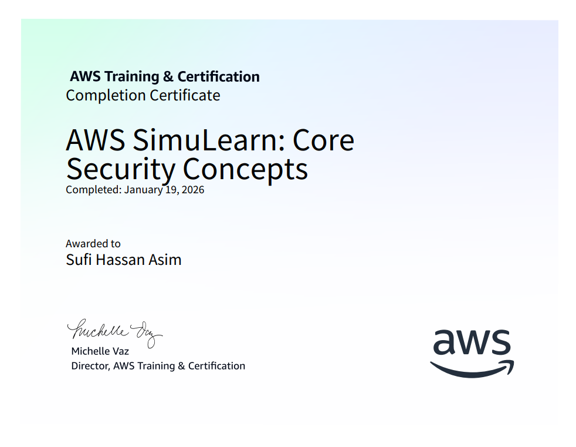
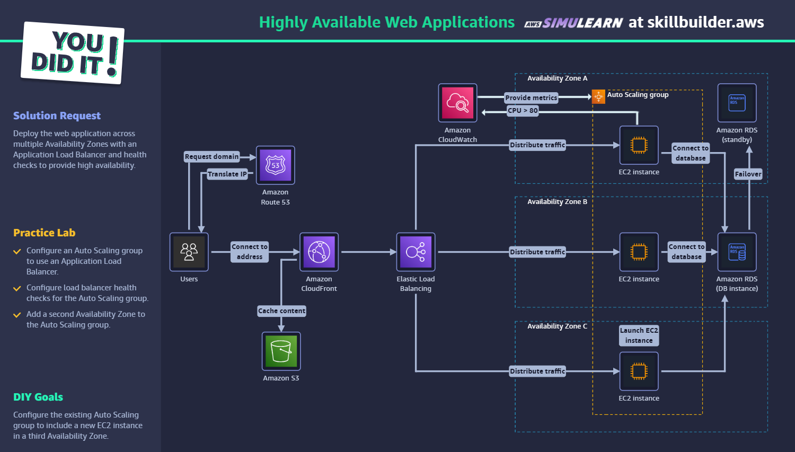
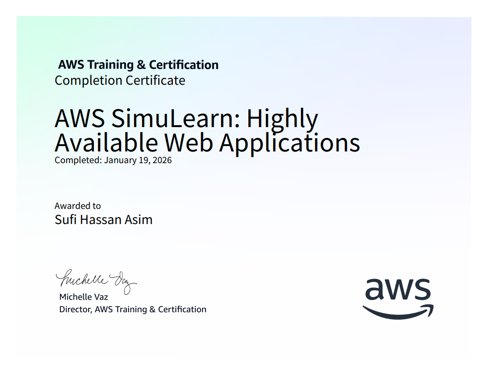

<h1 align="center">dpl_devops_training</h1>

<h3 align="center" style="color:#007bff;">Daily DevOps Practice • AWS Skill Builder Labs & Cloud Practitioner Certification</h3>

---

## 🎯 Objective
Complete multiple **AWS Skill Builder hands-on labs** and finalize **AWS Cloud Practitioner certification** to strengthen foundational cloud knowledge. Focus on **auto-healing applications**, **VPC connectivity**, **security concepts**, and **high availability web applications**.

---

## 💡 Summary / What I accomplished

**2026-01-19** was dedicated to comprehensive AWS learning through hands-on labs and certification completion:

1. **AWS Cloud Practitioner Certification**
   - Successfully completed AWS Cloud Practitioner certification
   - Demonstrated foundational understanding of AWS services and cloud concepts
   - Validated knowledge of AWS pricing, security, and architectural principles

2. **Auto-Healing and Scaling Applications Lab**
   - Implemented auto-scaling groups with health checks
   - Configured CloudWatch alarms for automated scaling
   - Tested application resilience and recovery mechanisms

3. **Connecting VPCs Lab**
   - Set up VPC peering connections between multiple VPCs
   - Configured route tables for cross-VPC communication
   - Implemented secure network connectivity patterns

4. **Core Security Concepts Lab**
   - Explored AWS IAM roles, policies, and permissions
   - Implemented security groups and NACLs
   - Applied security best practices for cloud resources

5. **Highly Available Web Applications Lab**
   - Deployed multi-AZ web application architecture
   - Configured Application Load Balancer with health checks
   - Implemented RDS Multi-AZ for database high availability

---

## 📋 Table of Contents

* [Lab Completions](#lab-completions)
* [Certification Achievement](#certification-achievement)
* [Key Learning Outcomes](#key-learning-outcomes)
* [Hands-on Experience](#hands-on-experience)
* [Evidence & Screenshots](#evidence--screenshots)
* [Skills Acquired](#skills-acquired)
* [Next Steps](#next-steps)

---

## 🧪 Lab Completions

### 1. Auto-Healing and Scaling Applications
**Objective**: Implement resilient application architecture with automatic scaling and healing capabilities.

**Key Activities**:
- Created Auto Scaling Groups with launch templates
- Configured CloudWatch metrics and alarms
- Implemented health checks and replacement policies
- Tested scaling policies under load conditions

**Technologies Used**: EC2, Auto Scaling Groups, CloudWatch, Application Load Balancer

### 2. Connecting VPCs
**Objective**: Establish secure connectivity between multiple Virtual Private Clouds.

**Key Activities**:
- Set up VPC peering connections
- Configured route tables for inter-VPC communication
- Implemented security groups for cross-VPC access
- Tested connectivity and troubleshooted routing issues

**Technologies Used**: VPC, VPC Peering, Route Tables, Security Groups

### 3. Core Security Concepts
**Objective**: Apply fundamental AWS security principles and access controls.

**Key Activities**:
- Created IAM users, groups, and roles
- Implemented least-privilege access policies
- Configured MFA and password policies
- Applied security groups and NACLs

**Technologies Used**: IAM, Security Groups, NACLs, AWS Organizations

### 4. Highly Available Web Applications
**Objective**: Design and deploy fault-tolerant web application architecture.

**Key Activities**:
- Deployed multi-AZ application infrastructure
- Configured Application Load Balancer with health checks
- Set up RDS Multi-AZ with automated failover
- Implemented S3 for static content delivery

**Technologies Used**: EC2, ALB, RDS, S3, Multi-AZ deployment

---

## 🏆 Certification Achievement

### AWS Cloud Practitioner Certification
**Status**: ✅ **COMPLETED**

**Certification Details**:
- Validates foundational understanding of AWS Cloud
- Covers AWS services, pricing, security, and compliance
- Demonstrates knowledge of cloud concepts and architectural principles
- Industry-recognized credential for cloud professionals

**Key Knowledge Areas Validated**:
- Cloud concepts and value proposition
- AWS global infrastructure and services
- Security and compliance in the AWS Cloud
- Billing, pricing, and support models

---

## 🖼️ Evidence & Screenshots

### AWS Cloud Practitioner Certification
**Certificate of completion:**

### Auto-Healing and Scaling Applications Lab
**Lab completion and certificate:**

**Task implementation evidence:**

### Connecting VPCs Lab
**Lab completion and certificate:**

### Core Security Concepts Lab
**Lab completion and certificate:**

### Highly Available Web Applications Lab
**Lab completion and certificate:**

---

## 🚀 Key Learning Outcomes

### Auto-Scaling & Resilience
- Mastered Auto Scaling Group configuration and policies
- Learned CloudWatch metrics integration for automated scaling
- Understanding of health check mechanisms and replacement strategies
- Experience with load testing and scaling validation

### Network Connectivity
- Proficiency in VPC peering setup and configuration
- Route table management for complex network topologies
- Security group rules for cross-VPC communication
- Troubleshooting network connectivity issues

### Security Fundamentals
- IAM best practices for user and role management
- Least-privilege access principle implementation
- Multi-factor authentication configuration
- Security group vs NACL usage patterns

### High Availability Design
- Multi-AZ deployment strategies
- Load balancer configuration and health checks
- Database failover and backup strategies
- Fault-tolerant architecture patterns

---

## 📁 Files & Artifacts
- **Certificates**: All lab completion certificates saved in `images/` folder
- **Lab Guides**: PDF documentation for each completed lab
- **Credentials**: AWS account credentials for lab access (securely stored)
- **Key Pairs**: EC2 key pairs for lab instances (GameServerKeyPair.pem)

---

## ✅ Skills Acquired

| Skill Area | Technologies | Proficiency Level |
|------------|-------------|-------------------|
| Auto Scaling | EC2 Auto Scaling Groups, CloudWatch | ✅ Intermediate |
| Network Design | VPC, Peering, Route Tables | ✅ Intermediate |
| Security | IAM, Security Groups, NACLs | ✅ Intermediate |
| High Availability | Multi-AZ, ALB, RDS | ✅ Intermediate |
| Monitoring | CloudWatch Metrics, Alarms | ✅ Beginner |

---

## 🔭 Next Steps

1. **Advanced Networking**: Explore Transit Gateway and VPN connections
2. **Security Deep Dive**: Advanced IAM policies and AWS Organizations
3. **Monitoring & Logging**: CloudTrail, Config, and advanced CloudWatch features
4. **Automation**: Infrastructure as Code with CloudFormation/CDK
5. **Containerization**: ECS and EKS hands-on labs
6. **Serverless**: Lambda and API Gateway implementation

---

## 📚 References

* [AWS Skill Builder](https://skillbuilder.aws/)
* [AWS Cloud Practitioner Exam Guide](https://aws.amazon.com/certification/certified-cloud-practitioner/)
* [AWS Auto Scaling User Guide](https://docs.aws.amazon.com/autoscaling/)
* [Amazon VPC User Guide](https://docs.aws.amazon.com/vpc/)
* [AWS Security Best Practices](https://aws.amazon.com/architecture/security-identity-compliance/)
* [AWS Well-Architected Framework](https://aws.amazon.com/architecture/well-architected/)

---

## 📞 Contact

- Email: hassan.u@dplit.com

> 2026-01-19 marked a significant milestone with AWS Cloud Practitioner certification completion and comprehensive hands-on lab experience across core AWS services and architectural patterns.

Made by Sufi Hassan Asim — 2026-01-19