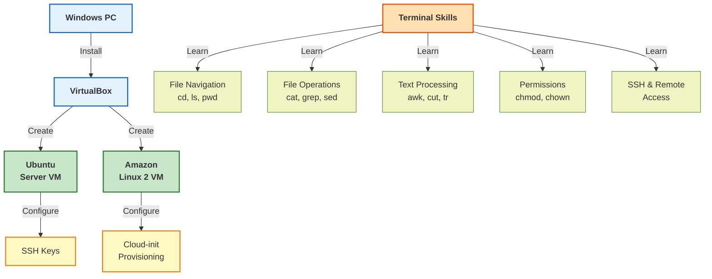
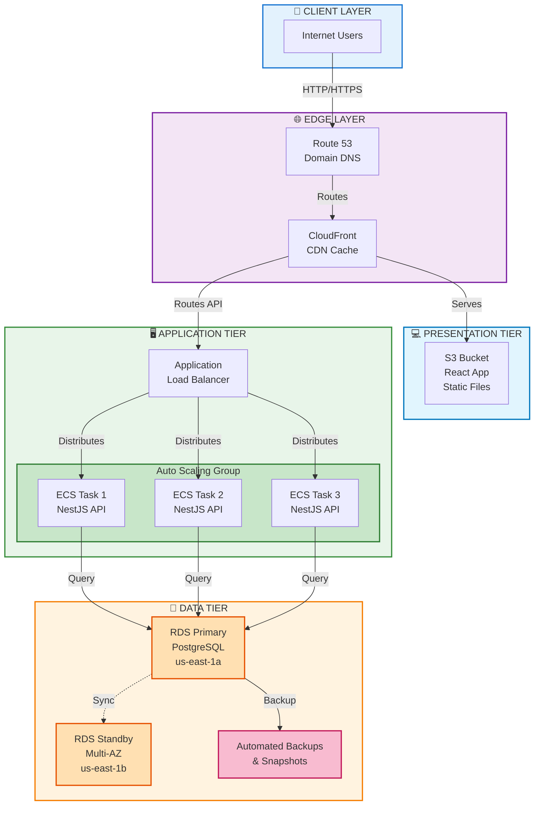
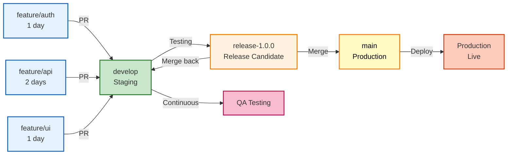
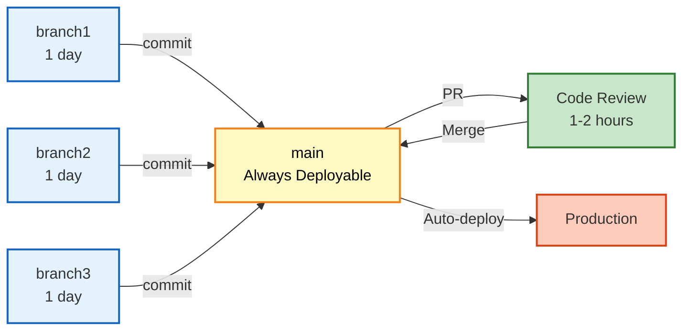
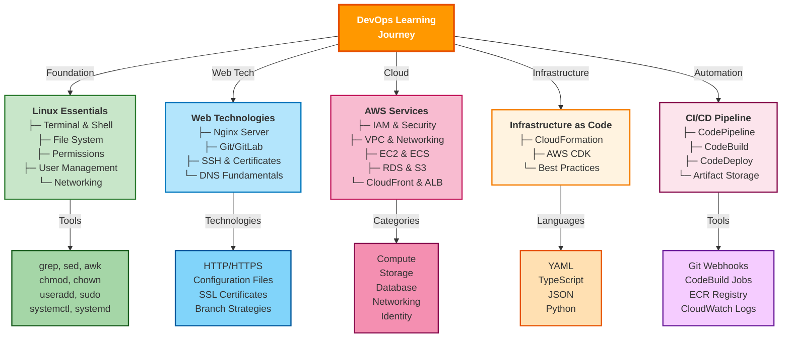

# DevOps Learning Roadmap - Visual Diagrams & Flow Charts

## 📊 Learning Journey Timeline

```mermaid
graph LR
    A["<b>WEEK 1-2</b><br/>FOUNDATIONS"] -->|Linux & VMs| B["<b>WEEK 2-3</b><br/>WEB TECH"]
    B -->|Nginx, Git, TS| C["<b>WEEK 3-4</b><br/>CLOUD BASICS"]
    C -->|AWS Services| D["<b>WEEK 4-7</b><br/>INTERMEDIATE"]
    D -->|IAM, CF, VPC| E["<b>WEEK 7-8</b><br/>ADVANCED"]
    E -->|CDK, CI/CD| F["<b>WEEK 8-9</b><br/>PRODUCTION"]
    F -->|Full Stack| G["✅ COMPLETE"]
    
    style A fill:#e1f5ff,stroke:#01579b,stroke-width:2px,color:#000
    style B fill:#fff3e0,stroke:#e65100,stroke-width:2px,color:#000
    style C fill:#f3e5f5,stroke:#4a148c,stroke-width:2px,color:#000
    style D fill:#e8f5e9,stroke:#1b5e20,stroke-width:2px,color:#000
    style E fill:#fce4ec,stroke:#880e4f,stroke-width:2px,color:#000
    style F fill:#fff9c4,stroke:#f57f17,stroke-width:2px,color:#000
    style G fill:#c8e6c9,stroke:#2e7d32,stroke-width:3px,color:#000
```



---

## 🏗️ Phase-wise Learning Breakdown

### Phase 1: Foundations (Week 1-2)



### Phase 2: Web Technologies (Week 2-3)

```mermaid
graph TD
    A["<b>Phase 2:<br/>Web Technologies</b>"]
    
    A -->|Server| B["<b>Nginx</b><br/>Web Server"]
    A -->|VCS| C["<b>Git</b><br/>Version Control"]
    A -->|Language| D["<b>TypeScript</b><br/>Programming"]
    
    B -->|Configure| B1["Virtual Hosts"]
    B -->|Configure| B2["Reverse Proxy"]
    B -->|Configure| B3["SSL/TLS"]
    B -->|Configure| B4["Load Balancing"]
    
    C -->|Learn| C1["Git Internals<br/>.git Structure"]
    C -->|Learn| C2["Branching &<br/>Merging"]
    C -->|Learn| C3["Conflict<br/>Resolution"]
    C -->|Learn| C4["Rebase vs<br/>Merge"]
    C -->|Learn| C5["Pull Request<br/>Workflows"]
    
    D -->|Learn| D1["Type System"]
    D -->|Learn| D2["Interfaces &<br/>Classes"]
    D -->|Learn| D3["Generics &<br/>Advanced"]
    D -->|Learn| D4["Modules &<br/>Imports"]
    
    style A fill:#fff3e0,stroke:#e65100,stroke-width:3px
    style B fill:#ffe0b2,stroke:#d84315,stroke-width:2px
    style C fill:#f3e5f5,stroke:#6a1b9a,stroke-width:2px
    style D fill:#e1f5fe,stroke:#01579b,stroke-width:2px
    style B1 fill:#ffccbc,stroke:#bf360c,stroke-width:1px
    style B2 fill:#ffccbc,stroke:#bf360c,stroke-width:1px
    style B3 fill:#ffccbc,stroke:#bf360c,stroke-width:1px
    style B4 fill:#ffccbc,stroke:#bf360c,stroke-width:1px
    style C1 fill:#f8bbd0,stroke:#ad1457,stroke-width:1px
    style C2 fill:#f8bbd0,stroke:#ad1457,stroke-width:1px
    style C3 fill:#f8bbd0,stroke:#ad1457,stroke-width:1px
    style C4 fill:#f8bbd0,stroke:#ad1457,stroke-width:1px
    style C5 fill:#f8bbd0,stroke:#ad1457,stroke-width:1px
    style D1 fill:#b3e5fc,stroke:#01579b,stroke-width:1px
    style D2 fill:#b3e5fc,stroke:#01579b,stroke-width:1px
    style D3 fill:#b3e5fc,stroke:#01579b,stroke-width:1px
    style D4 fill:#b3e5fc,stroke:#01579b,stroke-width:1px
```



### Phase 3: Cloud Fundamentals (Week 3-4)

```mermaid
graph TD
    A["<b>AWS Cloud<br/>Fundamentals</b>"]
    
    A --> B["<b>Global Infrastructure</b>"]
    A --> C["<b>Compute Services</b>"]
    A --> D["<b>Storage Services</b>"]
    A --> E["<b>Database Services</b>"]
    A --> F["<b>Identity & Access</b>"]
    
    B -->|Components| B1["Regions"]
    B -->|Components| B2["Availability<br/>Zones"]
    B -->|Components| B3["Edge<br/>Locations"]
    
    C -->|Services| C1["EC2 Instances"]
    C -->|Services| C2["Auto Scaling"]
    C -->|Services| C3["Lambda"]
    C -->|Services| C4["ECS/Fargate"]
    
    D -->|Services| D1["S3 Buckets"]
    D -->|Services| D2["EBS Volumes"]
    D -->|Services| D3["CloudFront<br/>CDN"]
    D -->|Services| D4["EFS"]
    
    E -->|Services| E1["RDS"]
    E -->|Services| E2["DynamoDB"]
    E -->|Services| E3["Backups"]
    
    F -->|Components| F1["Users & Roles"]
    F -->|Components| F2["Policies"]
    F -->|Components| F3["Credentials"]
    
    style A fill:#f3e5f5,stroke:#4a148c,stroke-width:3px
    style B fill:#e1f5fe,stroke:#01579b,stroke-width:2px
    style C fill:#e8f5e9,stroke:#1b5e20,stroke-width:2px
    style D fill:#fff3e0,stroke:#e65100,stroke-width:2px
    style E fill:#fce4ec,stroke:#880e4f,stroke-width:2px
    style F fill:#fff9c4,stroke:#f57f17,stroke-width:2px
```



---

## 🎯 AWS Service Categories & Usage

```mermaid
graph TB
    AWS["<b>AWS ECOSYSTEM</b>"]
    
    AWS -->|COMPUTE| COMP["EC2, ECS, Lambda,<br/>Fargate, Auto Scaling"]
    AWS -->|STORAGE| STOR["S3, EBS, EFS,<br/>CloudFront"]
    AWS -->|NETWORK| NET["VPC, ALB, NLB,<br/>Route53, CloudFront"]
    AWS -->|DATABASE| DB["RDS, DynamoDB,<br/>Elasticache"]
    AWS -->|IDENTITY| IAM["IAM, Secrets Manager,<br/>KMS"]
    AWS -->|INFRASTRUCTURE| IaC["CloudFormation,<br/>AWS CDK"]
    AWS -->|CI/CD| CICD["CodePipeline,<br/>CodeBuild, CodeDeploy"]
    AWS -->|MONITORING| MON["CloudWatch, X-Ray,<br/>CloudTrail"]
    
    style AWS fill:#ff9800,stroke:#e65100,stroke-width:3px,color:#fff
    style COMP fill:#66bb6a,stroke:#2e7d32,stroke-width:2px
    style STOR fill:#42a5f5,stroke:#1565c0,stroke-width:2px
    style NET fill:#ab47bc,stroke:#6a1b9a,stroke-width:2px
    style DB fill:#ef5350,stroke:#c62828,stroke-width:2px
    style IAM fill:#ffa726,stroke:#e65100,stroke-width:2px
    style IaC fill:#ec407a,stroke:#ad1457,stroke-width:2px
    style CICD fill:#29b6f6,stroke:#01579b,stroke-width:2px
    style MON fill:#ffee58,stroke:#f57f17,stroke-width:2px,color:#000
```



---

## 🏗️ Three-Tier Architecture with AWS



---

## 🚀 CI/CD Pipeline Architecture

```mermaid
graph LR
    DEV["<b>Developer</b><br/>Commits Code"]
    REPO["<b>GitLab</b><br/>Repository"]
    STAR["<b>CodeStar</b><br/>Trigger"]
    PIPE["<b>CodePipeline</b><br/>Orchestrator"]
    
    subgraph BUILD["BUILD STAGE"]
        CB["CodeBuild<br/>├─ npm install<br/>├─ npm test<br/>└─ npm run build"]
    end
    
    subgraph TEST["TEST STAGE"]
        UNIT["Unit Tests<br/>Integration Tests<br/>Coverage Report"]
    end
    
    subgraph DEPLOY["DEPLOY STAGE"]
        ECR["Amazon ECR<br/>Push Image"]
        ECSK["Deploy to ECS<br/>Update Service"]
    end
    
    subgraph PROD["PRODUCTION"]
        ECS["ECS Cluster<br/>Running Containers"]
        LB["Load Balancer<br/>Traffic Distribution"]
    end
    
    DEV -->|Push| REPO
    REPO -->|Webhook| STAR
    STAR -->|Trigger| PIPE
    
    PIPE -->|Execute| CB
    CB -->|Run| UNIT
    
    UNIT -->|Success| ECR
    ECR -->|Deploy| ECSK
    ECSK -->|Update| ECS
    ECS -->|Distribute| LB
    
    style DEV fill:#e3f2fd,stroke:#1565c0,stroke-width:2px
    style REPO fill:#f3e5f5,stroke:#6a1b9a,stroke-width:2px
    style STAR fill:#e8f5e9,stroke:#2e7d32,stroke-width:2px
    style PIPE fill:#fff3e0,stroke:#f57c00,stroke-width:2px
    style BUILD fill:#c8e6c9,stroke:#2e7d32,stroke-width:2px
    style TEST fill:#b3e5fc,stroke:#0277bd,stroke-width:2px
    style DEPLOY fill:#f8bbd0,stroke:#c2185b,stroke-width:2px
    style PROD fill:#fff9c4,stroke:#f57f17,stroke-width:2px,color:#000
    style ECS fill:#ffccbc,stroke:#d84315,stroke-width:2px
    style LB fill:#ffccbc,stroke:#d84315,stroke-width:2px
```



---

```mermaid
graph TB
    APP["<b>AWS CDK App</b><br/>TypeScript Project"]
    
    APP -->|Creates| NS["Networking Stack"]
    APP -->|Creates| DS["Database Stack"]
    APP -->|Creates| CS["Compute Stack"]
    APP -->|Creates| CIS["CI/CD Stack"]
    
    subgraph NS_DETAILS["Networking Stack"]
        VPC["VPC<br/>10.0.0.0/16"]
        PUB["Public Subnets<br/>2x AZs"]
        PRIV["Private Subnets<br/>2x AZs"]
        DB_SUB["DB Subnets<br/>2x AZs"]
        IGW["Internet Gateway"]
        NAT["NAT Gateways"]
        SG["Security Groups"]
    end
    
    subgraph DS_DETAILS["Database Stack"]
        RDS["RDS PostgreSQL<br/>Multi-AZ"]
        DBG["DB Security Group"]
        DSSUB["DB Subnet Group"]
        PARAM["Parameter Groups"]
    end
    
    subgraph CS_DETAILS["Compute Stack"]
        ECR["ECR Repository"]
        CLUSTER["ECS Cluster"]
        TASK["Task Definition"]
        SERVICE["ECS Service"]
        ALB["Application<br/>Load Balancer"]
        ASG["Auto Scaling"]
        CW["CloudWatch Logs"]
    end
    
    subgraph CIS_DETAILS["CI/CD Stack"]
        CODESTAR["CodeStar<br/>Connection"]
        CODEPIPE["CodePipeline"]
        CODEBUILD["CodeBuild"]
        CODEDEPLOY["CodeDeploy"]
    end
    
    VPC --> PUB
    VPC --> PRIV
    VPC --> DB_SUB
    PUB --> IGW
    PRIV --> NAT
    
    RDS --> DSSUB
    RDS --> PARAM
    
    ECR --> TASK
    CLUSTER --> SERVICE
    SERVICE --> ALB
    SERVICE --> ASG
    SERVICE --> CW
    
    CODESTAR --> CODEPIPE
    CODEPIPE --> CODEBUILD
    CODEBUILD --> CODEDEPLOY
    
    style APP fill:#ff9800,stroke:#e65100,stroke-width:3px,color:#fff
    style NS_DETAILS fill:#c8e6c9,stroke:#2e7d32,stroke-width:2px
    style DS_DETAILS fill:#ffe0b2,stroke:#e65100,stroke-width:2px
    style CS_DETAILS fill:#b3e5fc,stroke:#0277bd,stroke-width:2px
    style CIS_DETAILS fill:#f8bbd0,stroke:#c2185b,stroke-width:2px
---

## 🌳 Git Workflow Strategies

### GitHub Flow (Simple)
```mermaid
graph TD
    A["Feature Branch<br/>feature/auth"] -->|commit| B["Feature Work<br/>feature/api"]
    C["Feature Branch<br/>feature/ui"] -->|commit| D["Pull Request<br/>to main"]
    A --> D
    B --> D
    C --> D
    D -->|Code Review| E["Approved"]
    E -->|Merge| F["main Branch"]
    F -->|CI/CD| G["Production<br/>Deployment"]
    
    style A fill:#e3f2fd,stroke:#1565c0,stroke-width:2px
    style B fill:#e3f2fd,stroke:#1565c0,stroke-width:2px
    style C fill:#e3f2fd,stroke:#1565c0,stroke-width:2px
    style D fill:#c8e6c9,stroke:#2e7d32,stroke-width:2px
    style E fill:#c8e6c9,stroke:#2e7d32,stroke-width:2px
    style F fill:#fff9c4,stroke:#f57f17,stroke-width:2px,color:#000
    style G fill:#ffccbc,stroke:#d84315,stroke-width:2px
```

### Gitflow Workflow (Complex)


### Trunk-Based Development


---

## 📈 Auto Scaling Configuration

```mermaid
graph TB
    ASG["<b>Auto Scaling Group</b><br/>Config"]
    
    ASG -->|Template| LT["Launch Template<br/>├─ AMI ID<br/>├─ Instance Type<br/>├─ Key Pair<br/>├─ Security Groups<br/>└─ User Data"]
    
    ASG -->|Capacity| CAP["Capacity Settings<br/>├─ Min: 2<br/>├─ Desired: 3<br/>└─ Max: 10"]
    
    ASG -->|Health| HC["Health Checks<br/>├─ Type: ELB<br/>└─ Grace: 300s"]
    
    ASG -->|Scaling| SP["Scaling Policies<br/>├─ CPU > 70% → ScaleOut<br/>├─ CPU < 30% → ScaleIn<br/>└─ Scale Rate: 1:1"]
    
    CAP -->|AZ Distribution| AZ["Multi-AZ Placement<br/>├─ us-east-1a<br/>└─ us-east-1b"]
    
    style ASG fill:#ff9800,stroke:#e65100,stroke-width:3px,color:#fff
    style LT fill:#c8e6c9,stroke:#2e7d32,stroke-width:2px
    style CAP fill:#b3e5fc,stroke:#0277bd,stroke-width:2px
    style HC fill:#f8bbd0,stroke:#c2185b,stroke-width:2px
    style SP fill:#fff3e0,stroke:#f57c00,stroke-width:2px
    style AZ fill:#fce4ec,stroke:#880e4f,stroke-width:2px
---

## 🔒 Security & Compliance Layers

```mermaid
graph TB
    SEC["<b>SECURITY ARCHITECTURE</b>"]
    
    SEC -->|Layer 1| NET["<b>Network Security</b><br/>VPC Isolation<br/>Security Groups<br/>NACLs<br/>VPC Flow Logs"]
    
    SEC -->|Layer 2| IAM["<b>Identity & Access</b><br/>IAM Roles<br/>Least Privilege<br/>MFA<br/>Credential Rotation"]
    
    SEC -->|Layer 3| DATA["<b>Data Protection</b><br/>TLS/SSL Encryption<br/>KMS Encryption<br/>Secrets Manager<br/>DB Encryption"]
    
    SEC -->|Layer 4| MON["<b>Monitoring & Logging</b><br/>CloudTrail<br/>CloudWatch Logs<br/>VPC Flow Logs<br/>X-Ray Tracing"]
    
    SEC -->|Layer 5| COMP["<b>Compliance & Audit</b><br/>AWS Config<br/>Security Hub<br/>GuardDuty<br/>Audit Trails"]
    
    style SEC fill:#d32f2f,stroke:#b71c1c,stroke-width:3px,color:#fff
    style NET fill:#c8e6c9,stroke:#2e7d32,stroke-width:2px
    style IAM fill:#b3e5fc,stroke:#0277bd,stroke-width:2px
    style DATA fill:#fff3e0,stroke:#f57c00,stroke-width:2px
    style MON fill:#f8bbd0,stroke:#c2185b,stroke-width:2px
    style COMP fill:#e1bee7,stroke:#7b1fa2,stroke-width:2px
```

---

## 🧠 Learning Resources Mind Map



---

## ✅ Verification Checklist by Phase

### Phase 1 - Foundations Complete
```
✓ Linux commands executed successfully (70+)
✓ VirtualBox VMs running stable
✓ SSH connectivity verified between VMs
✓ File permissions understood and applied
✓ Text processing with grep/sed/awk working
```

### Phase 2 - Web Technologies Complete
```
✓ Nginx installed and serving content
✓ Git repository created and used
✓ Pull requests created and reviewed
✓ Merge conflicts resolved
✓ TypeScript basic program compiled
```

### Phase 3 - Cloud Fundamentals Complete
```
✓ AWS Console access working
✓ EC2 instance launched and accessed
✓ S3 bucket created with objects
✓ CloudFront distribution working
✓ Static website accessible via CDN
```

### Phase 4 - Intermediate AWS Complete
```
✓ IAM roles created and policies attached
✓ CloudFormation template deployed
✓ VPC with subnets created
✓ Auto Scaling Group configured
✓ RDS database accessible from EC2
```

### Phase 5 - Advanced Architecture Complete
```
✓ CDK app synthesized and deployed
✓ NetworkingStack deployed
✓ CodePipeline triggered successfully
✓ Docker image built and pushed to ECR
✓ ECS service running behind ALB
```

### Phase 6 - Production Implementation Complete
```
✓ Three-tier architecture fully deployed
✓ Frontend (S3+CloudFront) accessible
✓ Backend (ECS+RDS) operational
✓ CI/CD pipeline automated end-to-end
✓ Monitoring and logging configured
```

- [ ] CI/CD pipeline automated
- [ ] Health monitoring with CloudWatch
- [ ] High availability verified
- [ ] Disaster recovery plan documented

---

**Reference Date:** January 20, 2026  
**Learning Program:** DPL DevOps Training Path
